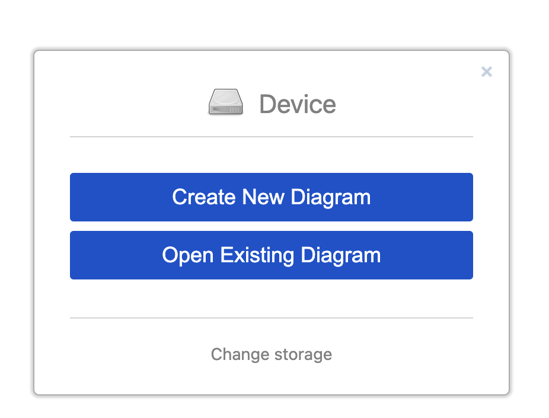

# My_Learning_System_Design

Learn everything about System Design

> All the learnings has to be made in respective repos like
>
> - Front-end + Back-end [here](https://github.com/abhi3700/My_Learning_NodeJSTS).
> - DevOps [here](https://github.com/abhi3700/My_Learning_DevOps).

## Overview

- There are different approaches to create a backend for an App. These are:

  - Monolithic
  - Multi-tier
  - Microservices using Docker, Kubernetes, Prometheus, Kafka, etc.
    

    > Microservices are not some magic which fixes all the problems. Still there are cases where monolithic approach is followed. For example, if you are building a small app, then you can go with monolithic approach. But if you are building a large app, then you should go with microservices approach. It's about **scalability** and **maintainability**.

    

- The most common API types are:
  - REST API
  - GraphQL
  - gRPC
- The most go-to backend as per me would be NextJS.
- Testing tools for end-to-end testing:
  - Playwright
  - Cypress
  - Selenium
  - Puppeteer

## Tools

There are beautiful designs which are normally used in the industry. And that require some tools to be used. Some of them are:

- [draw.io](https://app.diagrams.net/) [FREE]

  > You also have the option to change storage (local, cloud):

  

- For system design diagrams, you can use [Cloudcraft](https://cloudcraft.co/).

## References

### Channels, Blogs, Websites

- [ByteByteGo](https://bytebytego.com/), [YT](https://www.youtube.com/c/ByteByteGo)
- [Gaurav Sen YT channel](https://www.youtube.com/@gkcs)

### Books

- [System Design by ByteByteGo](./docs/system_design_bytebytego.pdf)

### Videos

- [Microservices explained in 5 minutes](https://www.youtube.com/watch?v=lL_j7ilk7rc)
