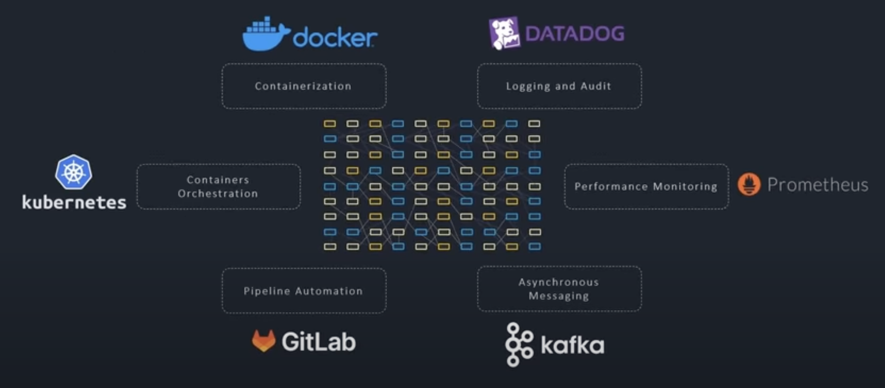
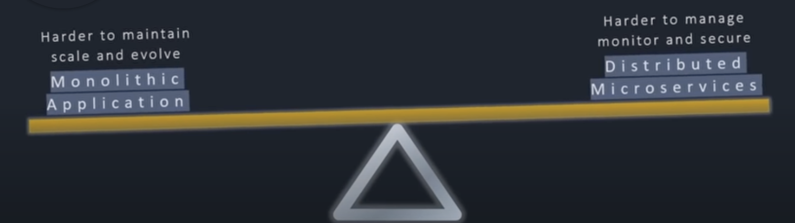

# My_Learning_System_Design

Learn everything about System Design

## Overview

- There are different approaches to create a backend for an App. These are:

  - Monolithic
  - Multi-tier
  - Microservices using Docker, Kubernetes, Prometheus, Kafka, etc.
    

    > Microservices are not some magic which fixes all the problems. Still there are cases where monolithic approach is followed. For example, if you are building a small app, then you can go with monolithic approach. But if you are building a large app, then you should go with microservices approach. It's about **scalability** and **maintainability**.

    

- The most common API types are:
  - REST API
  - GraphQL
  - gRPC
- The most go-to backend as per me would be NextJS.
- Testing tools for end-to-end testing:
  - Playwright
  - Cypress
  - Selenium
  - Puppeteer

## References

- [Microservices explained in 5 minutes](https://www.youtube.com/watch?v=lL_j7ilk7rc)
