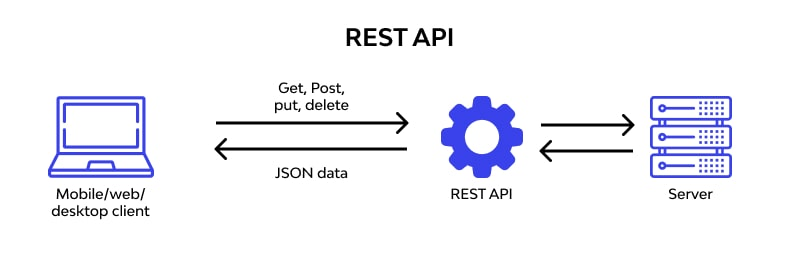
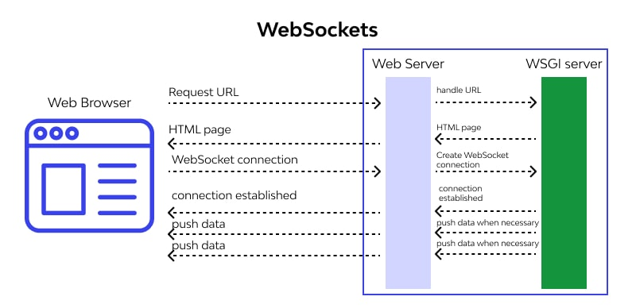

# REST API

Also, covered websockets

## Overview

This is a REST API documentation for an application that allows users to create, read, update and delete (CRUD) data from a database.

---

**Routes vs Endpoints**

- A route is the URL (or path) that a client uses to communicate with the server.
- An endpoint is one end of a communication channel.

Suppose, for a TODO App:

| Route       | API endpoint | HTTP Method | CRUD Method | Description   |
| ----------- | ------------ | ----------- | ----------- | ------------- |
| /tasks      | /tasks       | GET         | READ        | Get all tasks |
| /tasks      | /tasks       | POST        | CREATE      | Create a task |
| /tasks/{id} | /tasks/{id}  | PUT         | UPDATE      | Update a task |
| /tasks/{id} | /tasks/{id}  | DELETE      | DELETE      | Delete a task |

Here, routes are 2, but endpoints are 4.

## Installation

VSCode - [Thunder Client](https://marketplace.visualstudio.com/items?itemName=rangav.vscode-thunder-client)

## API data

- Free fake API for testing and prototyping: [Todo list](https://jsonplaceholder.typicode.com/todos)
- Create your API on this

## OpenAPI Specification

The Swagger UI is compatible with JSON, YAML as input/output parameters.

Example: https://petstore.swagger.io/

### Data Types

| type    | format   | Comments                        |
| ------- | -------- | ------------------------------- |
| integer | int32    | signed 32 bits                  |
| integer | int64    | signed 64 bits (a.k.a long)     |
| number  | float    |
| number  | double   |
| string  | password | A hint to UIs to obscure input. |

- primitive types: `integer`, `number` `string`, `boolean`.
- derived types: Object.

### Error Codes

| Code | Description           |
| ---- | --------------------- |
| 200  | OK                    |
| 201  | Created               |
| 204  | No Content            |
| 400  | Bad Request           |
| 401  | Unauthorized          |
| 403  | Forbidden             |
| 404  | Not Found             |
| 405  | Method Not Allowed    |
| 409  | Conflict              |
| 500  | Internal Server Error |

## REST API vs Websockets





Here are the key points from the [article](https://www.wallarm.com/what/websocket-vs-rest-api) titled "Websocket vs REST API. 💥 7 Significant Differences" from Wallarm, updated with emojis:

1. REST 🔄 and WebSocket 🌐 are two key technologies that developers deal with regularly. Understanding their differences and purposes is crucial for effective utilization 🎯.

2. REST is a collection of design principles or policies 📚 used extensively during web application/service development. It assists only HTTP protocol-based web application development. REST operations are stateless and standard, with every REST request created as per the HTTP verbs (GET, PUT, POST, and Delete) 📲.

3. The WebSocket protocol, contrary to REST, is stateful and helps two applications in seamless data transmission or information exchange 🔄. It's based on port & sockets and works only over a TCP connection. It supports bidirectional communication, meaning the same socket/port delivers and receives the data, establishing a continuous connection 🔗.

4. REST API exists to support stateless communication, where data is requested only when it's required by the web application. This is similar to the function of a vending machine 🏧, which provides goods only upon request.

5. WebSocket is used when an application demands ongoing or uninterrupted data delivery, such as in a chat application 💬. In such unbroken data delivery, using REST would be resource-extensive, whereas WebSocket simplifies the job 🎛️.

6. Key differences between WebSocket and REST include:

   - WebSocket is stateful and bidirectional, uses sockets and ports, and is used in the development of real-time applications ⏱️. It requires a unified TCP connection for client-server data exchange.
   - REST is stateless and unidirectional, and is useful when there is heavy request traffic for an application/solution 🚦. It requires a new TCP connection each time a request is made.

7. REST is suitable when data is available on an ad-hoc basis and diversity is required 🌈. WebSocket is ideal when the application should not miss a single entry in the delivery, such as applications demanding tick data analysis or where there is high load or request traffic 📈.

8. Regardless of the choice between REST and WebSocket, adopting stringent and robust API security 🔒 is a must as it leads to secure data transmission and exchange. It ensures that only secure APIs are used and data transmitted isn't in the reach of threat actors 🕵️‍♀️.

## Concurrency

For any scalable REST APIs, concurrency is a must.

### Explanation

<details><summary><b>In simple words:</b></summary>
Absolutely, I can try to explain using emojis and diagrams. However, please note that as a text-based AI, my ability to create diagrams is quite limited.

In a Next.js server, when you get multiple API requests, they are like a queue of people (requests) 🚶‍♀️🚶‍♂️🚶‍♀️🚶‍♂️ waiting to be served.

Let's say these people are waiting for two things: a cup of coffee ☕ and a sandwich 🥪. These are like two different API endpoints.

In a normal scenario without concurrency, this would be like serving each person one by one:

1. Serve coffee ☕ to the first person 🚶‍♀️
2. Serve sandwich 🥪 to the first person 🚶‍♀️
3. Only then move to the second person 🚶‍♂️

In this scenario, every other person has to wait until the person in front of them gets both their coffee and sandwich.

With concurrency, this process changes. You start making coffee and sandwiches for everyone at the same time:

1. Start making coffee ☕ for the first person 🚶‍♀️
2. Without waiting for the coffee to finish, start making a sandwich 🥪 for the first person 🚶‍♀️
3. Without waiting for the first person's coffee or sandwich to finish, start making coffee for the second person 🚶‍♂️
4. Continue this process for everyone in the line.

In code, this would look something like this:

```javascript
import fetch from "node-fetch";

export default async function handler(req, res) {
  const urls = ["https://api.example1.com", "https://api.example2.com"];

  const requests = urls.map((url) => fetch(url));

  try {
    const responses = await Promise.all(requests);

    const data = await Promise.all(
      responses.map((response) => response.json())
    );

    res.status(200).json(data);
  } catch (error) {
    res.status(500).json({ error: "Something went wrong" });
  }
}
```

Please note, the maximum number of people (requests) you can serve at once depends on how many baristas (server resources) you have. If you have more people than your baristas can handle, you might need more baristas (upgraded hardware, more servers, etc.).

I hope this helps! Let me know if you have any other questions.

</details>

<details><summary><b>In technical terms:</b></summary>

In this example, the API endpoint defined in Next.js sends two requests to different URLs concurrently. `Promise.all` is used to wait for all of the requests to complete. The responses are then converted to JSON concurrently, and the resulting data is sent back as the response to the original request.

Note that while Node.js is single-threaded, it can handle many requests concurrently thanks to its non-blocking IO operations and the event loop. However, CPU-bound tasks (like heavy computations) are still blocking in Node.js. Therefore, if you have CPU-bound tasks in your API endpoints, they could potentially block other requests. In such cases, you might want to consider offloading those tasks to worker threads or a separate service.

It's also worth noting that there are limits to how many concurrent connections a single Node.js server can handle, which are influenced by factors like the server's hardware and the Node.js configuration. If you need to handle a very high number of concurrent connections, you might need to use techniques like clustering or horizontal scaling.

</details>

### Languages

It can be achieved by incorporating

- **Node**: `Promises.all` in NodeJS frameworks
- **Rust**: adding multiple worker threads in `actix-web` (by default it uses max. CPU cores) for REST APIs. [Example](https://github.com/abhi3700/My_Learning-Rust/tree/main/libs/databases/pgsql/demo)
  > For websockets, use `actix` crate for concurrency actor model.

## Reference

- [OpenAPI Specification](https://swagger.io/specification/)
