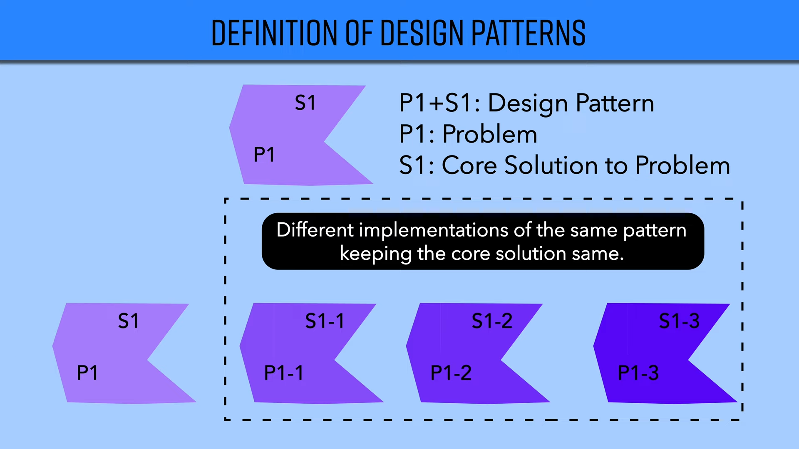

# Design Patterns

## Overview

Design patterns are the common patterns to a real world problems.

The implementation of these patterns may vary based on the language and the framework. But, the pattern remains the same.

## A. Patterns

There are some common patterns that are used in software development. These patterns are used to solve common problems.

It is important to understand these patterns and their implementation in different (at least 1) languages and frameworks.

## B. Problems

There are some common problems that are solved using design patterns.

If you take the example of cities. They have some common problems like:

- How to manage traffic?
- How to manage garbage?
- How to manage water?
- How to manage electricity?

## C. Solutions

These problems are solved using some common solutions like:

- Traffic lights
- Garbage bins
- Water tanks
- Electricity poles, boards, etc.

## D. Consequences

These solutions have some common consequences like:

- Traffic lights are expensive
- Garbage bins are expensive
- Water tanks are expensive
- Electricity poles, boards, etc. are expensive

Hence, these should be kept in mind while applying the design patterns.

## References

- [Refactoring Guru Design Patterns](https://refactoring.guru/design-patterns)
- [What are Design Patterns? | Design Patterns 101 | System Design | 2022 | Yogita Sharma](https://www.youtube.com/watch?v=FM_pRefVCB4) ✅
