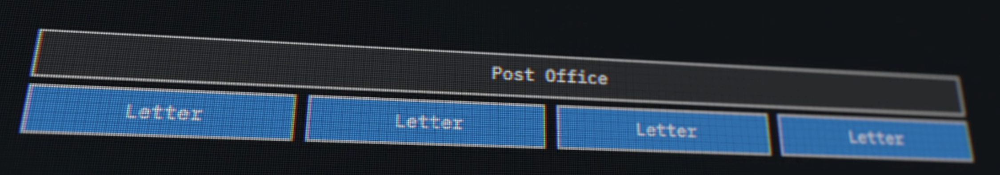
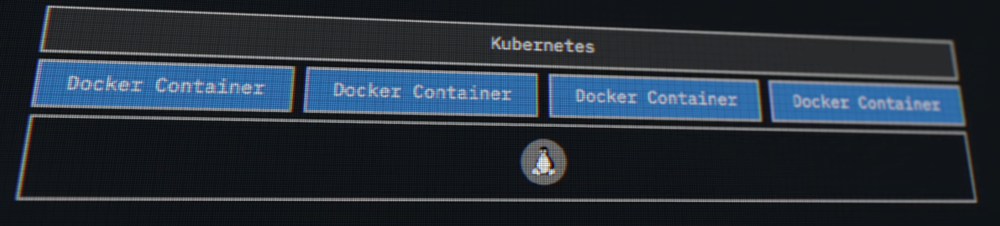

# Kubernetes

## Overview

[Why Kubernetes?](https://dev.to/aabhassao/kubernetes-bedtime-stories-393n)

- <u>Facts from Founders</u>:
  - Kubernetes wouldn't have been possible w/o Docker.
  - Google really wanted to keep the competition on with AWS S3.
  - CoreOS wanted to take linux to the cloud level. RedHat was thinking of the same thing as well.
  - Kubernetes really started as a project to make Docker work better in the cloud. But, it turned out to be a lot more than that.
  - Kubernetes team was working very hard to make it work with Docker & wanted the community to embrace it. There were other competitors like Mesos, Swarm, etc. But, Kubernetes was the one that was able to get the community to embrace it eventually, especially after the Pokemon Go incident, which literally broke the internet. And also proved that Kubernetes was the right tool for the job in handling the load.
  - There was no zero-sum game. All the best ideas helped in consolidating the Kubernetes.
- Kubernetes is a container orchestration tool.
- Each container (built using `docker` tool) can be deployed to different cloud providers like AWS, GCP, Azure, etc.
- Kubernetes is a tool that helps in deploying and managing containers.
- **Analogy**: Just like post office helps in delivering letters to different addresses, Kubernetes helps in deploying containers to different cloud providers. No matter what, the container will be delivered to the address just like the letter will be delivered to the address mentioned on the envelope, managed well by post office. So, the objective is to keep the container (holding Apps, microservices) running and healthy.

  

  

## References

### Videos

- [Kubernetes: The Documentary [PART 1]](https://www.youtube.com/watch?v=BE77h7dmoQU) ✅
- [Kubernetes: The Documentary [PART 2]](https://www.youtube.com/watch?v=318elIq37PE) ✅
