# System Design

## Overview

- Learn about System Design components

## Topics

- [x] **CDN**
  - geographically democratize the data storage so that the data is closer to the user during read. So, for application with write/read ratio as `1:10`, it is better to use CDN.

---

- [x] **Database selection**

  - There are cases where relational DB is better than NoSQL DB. E.g. if the data is highly structured and the data is not changing frequently, then relational DB is better. Like in Instagram, in order to create shorts, the data is highly structured and the data is not changing frequently. So, relational (**SQL**) DB is better to store the user data. But, then there is a need to store the video metadata. So, in this case, **NoSQL** DB is better. Because it can be used to store the video metadata inclusive of video properties - thumbnail, title, description, etc. Also, NoSQL DB is good for recommendation algorithm as it can be fed into a recommendation algorithm faster due to low latency.

    > Note that the file (video) storage is done into Amazon S3 cloud storage here.

  - **DB** storage is **NOT** recommended for image, video storage in form of encoded format. As the user grows, DB cost is going to be very high. So, it is better to store the image, video in form of encoded format in cloud storage like **Amazon S3**.

---

- [x] **Vertical scaling** (**up/down** `⬆️`/`⬇️`) is the process of increasing or reducing the size or power of a single instance in order to help it better respond to changing workloads. Vertical scaling enables you to increase or reduce the amount of memory, CPU cores, network bandwidth and other resources available to each individual instance. It is often used to improve performance or to increase the number of instances to handle more requests or users.

  - Use cases:
    - Used in non-distributed systems like databases, ROS, etc.
  - So, in a computer system, the processor, ram and storage are the components that can be scaled vertically.
  - In AWS, increase the **size** of the instance.

    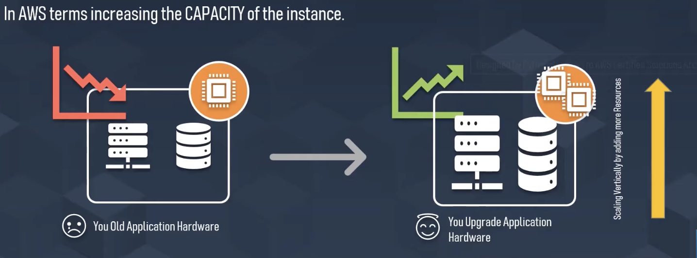

  - In the similar eg as previous, a bigger car has to be hired in order to accommodate more people. So, **the capacity of the car** is increased.

    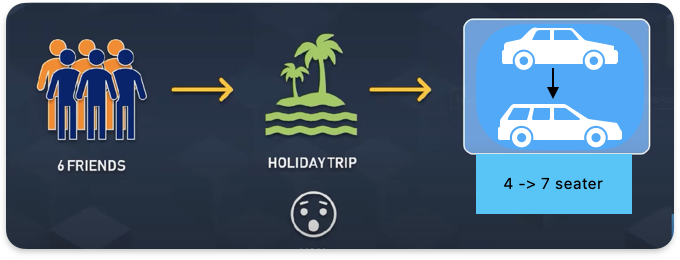

---

- [x] **Horizontal Scaling** (**in/out** `>---<` `<--->`) is the process of increasing or decreasing the capacity of a cloud environment by adding or removing instances. Horizontal scaling allows you to quickly increase or decrease the amount of computing power you have available and is often used to adjust your environment to accommodate more requests or users.

  - Use cases:
    - Used in distributed systems/microservices based. Hosting your app in multiple AZs (Availability Zones) across the globe.
      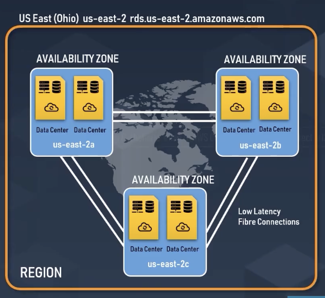
    - in load balancer (multi AZ)
    - in auto scaling group (multi AZ)
  - Features:
    - High availability is on the line of the horizontal scaling.
    - make it more available to the users by having them hosted across multiple AZs (Availability Zones) across the globe.
    - It will help your users reduce failures of one or two data centres going down.
  - Cons: very expensive as more identical resources would be required.
  - So, in a computer system, more computers can be added to the system in order to increase the capacity of the system. This is called horizontal scaling.
  - In AWS, increase the **number** of instances in the Auto Scaling Group.
    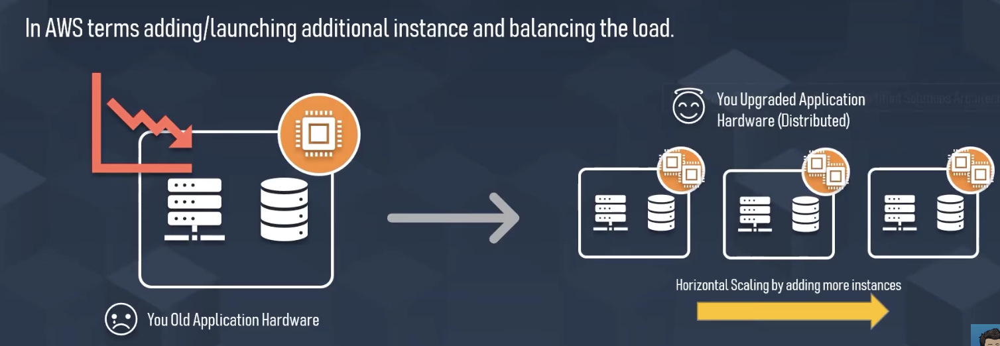

  Imagine, there is a holiday planned for 3 friends & then 3 more friends join them. So, in order to accommodate more people, more cars of same size has to be hired. So, **the number of cars** is increased.
  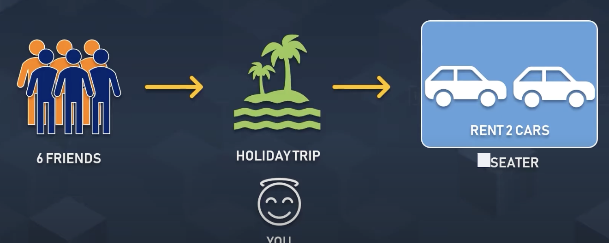

---

- [x] **Horizontal vs Vertical Scaling comparo**

| Horizontal Scaling                                                         | Vertical Scaling                                   |
| -------------------------------------------------------------------------- | -------------------------------------------------- |
| Load balancing required                                                    | N/A                                                |
| **Resilient**                                                              | Single point of failure                            |
| Network calls (RPC)                                                        | Shared memory i.e. **inter-process communication** |
| Data inconsistency i.e. delay in having the same data across all instances | Data **consistency**                               |
| **Scales as users increases i.e. via adding more instances**               | Hardware limit                                     |

> Now, the question is, when to use which scaling technique?
>
> Both are important. But, it depends on the use case. If the use case is such that the data is not changing frequently, then vertical scaling is better. But, if the data is changing frequently, then horizontal scaling is better. Moreover, keep a note of the bolded points in the table above.

- [x] Cloud storage selection
  - Amazon S3 is used for storing the video files or large files. The reasons for this are:
    - reliability (99.999999999%) as there are multiple copies of the data stored in different AZs (Availability Zones) across the globe.
    - high throughput during read/write
    - low latency due to CDN
- [ ] Cloud Function
- [ ] CRON job
- [ ] Rate limiting
  - Ideally it means if there is a limit of some activity to be done in a given time period. E.g. in **TikTok**, suppose there is a limit of 3 short videos that can be uploaded in 10 hrs. So, if a user tries to upload more than 3 short videos in 10 hrs, then the user will be blocked for the next 10 hrs.
- [ ] Caching
  - recommended to use Redis
- [ ] Message Broker
  - recommended to use Redis
- [ ] MongoDB architecture
- [ ] PostgreSQL architecture
- [ ] NextJS vs NestJS
- [ ] Low Level Design
- [ ] High Level Design
- [ ] Load balancing
- [ ] Microservices
- [ ] Monolithic vs Microservices
- [ ] Containerization
- [x] Prometheus
  - Prometheus is an open-source system for monitoring and alerting. It was initially developed at SoundCloud in 2012, but since then, it has grown to be one of the most popular monitoring systems available.
  - It is a time-series database that focuses on performance monitoring and event/alert management.
  - **Multi-dimensional data model**: allows users to efficiently store multiple data dimensions.
  - **Query language (PromQL)**: provides powerful querying of time-series data stored in Prometheus.
  - **Pull-based Metrics collection**: Rather than waiting for metrics to be pushed to it, Prometheus scrapes endpoints specified by a user-defined configuration file.
  - **Service discovery**: can automatically discover targets and provides various service discovery integrations.
  - **Alerting**: alerts can be configured to notify users via Slack or other channels if certain thresholds are exceeded.
  - Prometheus has become an essential part of modern cloud-native architectures alongside other tools such as Kubernetes, Istio, and Envoy. <kbd>chatGPT-3</kbd>
- [x] RPC vs HTTP

| RPC                                                                                                                                                               | HTTP                                                                                                                                                                                                                                                                                                                        |
| ----------------------------------------------------------------------------------------------------------------------------------------------------------------- | --------------------------------------------------------------------------------------------------------------------------------------------------------------------------------------------------------------------------------------------------------------------------------------------------------------------------- |
| stands for Remote Procedure Call to have a request from client to server & waits for response from the server                                                     | stands for Hypertext Transfer Protocol, both are used for communication between client and server sides.                                                                                                                                                                                                                    |
| `client` -> `server` function call from a remote machine. the client sends a request to the server and waits for the response.                                    | `client` <--> `server` communication. a protocol that is used by web browsers and servers to send and receive data over the internet. In HTTP, the client sends a request to the server, and the server responds with a message.                                                                                            |
| **Advantages**: Provides better performance compared to HTTP. Supports multiple protocols like JSON-RPC, XML-RPC, etc. Less overhead due to smaller message size. | **Advantages**: Widely adopted and supported across different platforms. Supports stateless communication between the client and server. An extensive set of status codes provides more detailed information about the request/response.                                                                                    |
| **Disadvantages**: Tight coupling between the client and the server. Difficult to implement, as you need to define the protocol for data exchange.                | **Disadvantages**: Has higher overhead due to the larger message size required. Limited flexibility compared to RPC. In summary, RPC is better suited for systems where low latency and high throughput are crucial, while HTTP is better suited for web-based applications, where compatibility and support are important. |

- [x] Authentication vs Authorization
  - The former is the process of verifying **who a user is**, while the latter is the process of verifying **what they have access to** when accessing a resource (via API call: `GET`, `POST`, `DELETE`).
- [x] Token (JWT) Authentication & Authorization

  - JSON Web Token (new technique than the old one of using cookies).
  - The cookies based session id used to be like this:
    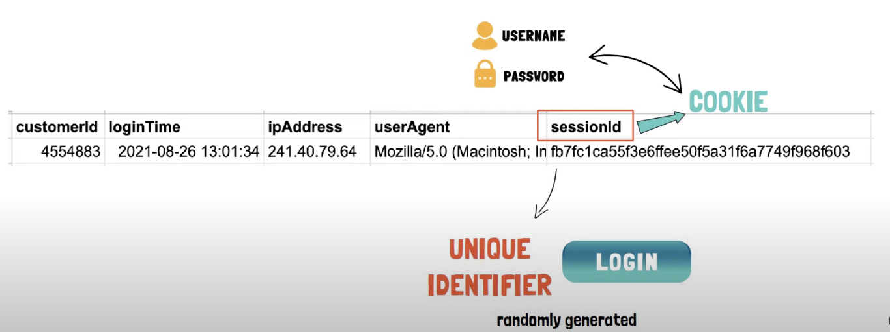
  - The users' sessions used to be saved on server side like this:
    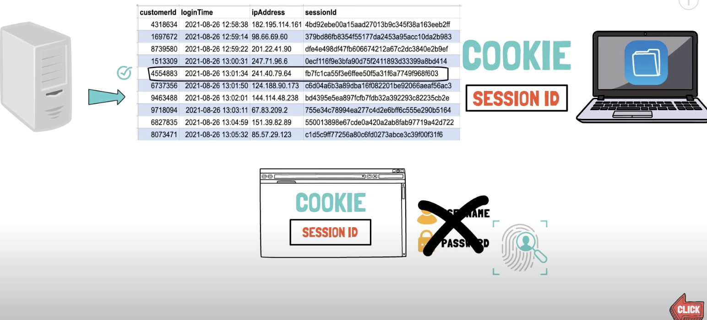
  - **Background**: Ideally, when a user logins into a platform, the user has to provide username, password, etc. Then, the server checks if the user is valid or not. If the user is valid, then the server generates a token & sends it back to the client. The client stores this token in the browser. Then, whenever the user wants to access a resource i.e. from next time onwards, the client sends the token to the server. The server checks if the token is valid or not. If the token is valid, then the server sends the resource to the client. If the token is invalid, then the server sends an error message to the client. So, this is how the authentication & authorization is done.
  - **Problem that got solved**: In cookies, the user's data is stored in the browser. So, if the user's browser is hacked, then the hacker can get the user's data. So, to solve this problem, JWT is used. JWT is a token that is generated by the server & sent to the client. The client stores this token in the browser. So, if the user's browser is hacked, then the hacker can't get the user's data as the token is stored in the server as well.
  - **Storage**:
    - On the client level, JWT token is stored in the browser's local storage or cookies or local DB (in case of android, iOS apps).
    - On the server level, JWT token is stored in the database.
  - **Expiry**: JWT token normally has an expiry time. So, after the expiry time, the user has to login again. E.g. in **TikTok**, the expiry time is 30 days, so after 30 days, the user has to login again. In Banks, the expiry time is 5-10 mins, so after 5-10 mins, the user has to login again.
  - **Cross-platform**: JWT token can be used in any platform. E.g. in **TikTok**, the user can login from the web app, mobile app, etc. Earlier the challenge was the client side storage i.e. every time the browser took the responsibility of storing in cookies. But for android, desktop, iOS or other platforms, the client side storage was a bit problematic. So, in case of JWT, on client-level, the storage is done in a local DB managed by the app. So, the app can store the token in the local DB and can use it for authentication.
  - **JWT components**: the token generation process starts after entering the username & password. The server checks if the username & password are valid or not. If the username & password are valid, then the server generates a token. The token is generated using 3 components:

    - <u>header</u>: contains the algorithm (hashing) & token type i.e. JWT. Looks like this:
      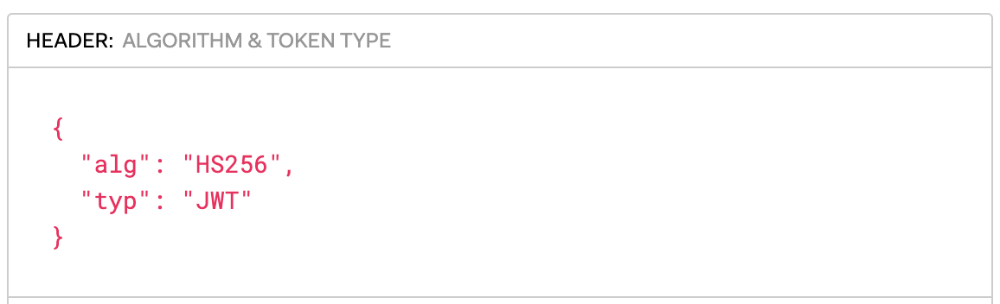
    - <u>payload</u>: pulls the data stored corresponding to the username/hashed_password (in server DB). Looks like this -
      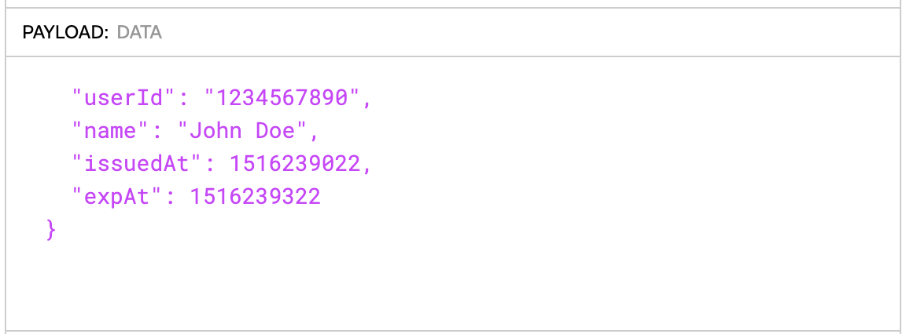
    - <u>signature</u>: `HMACSHA256 of (encoded header + encoded payload, secret key)` The secret key can be based on symmetric/assymetric encryption method. The secret/private key has to be stored securely on server side. Looks like this:
      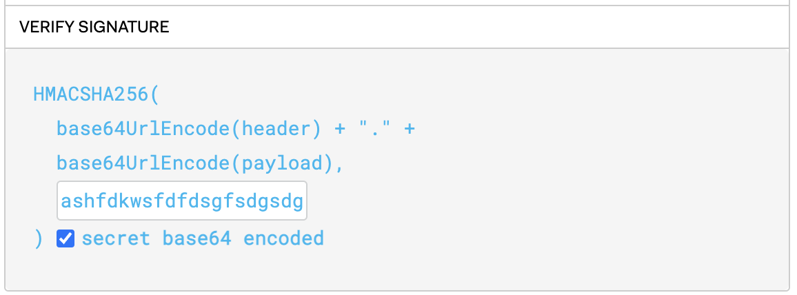

  - **Token**: all 3 components are combined to form JWT. The token generation
    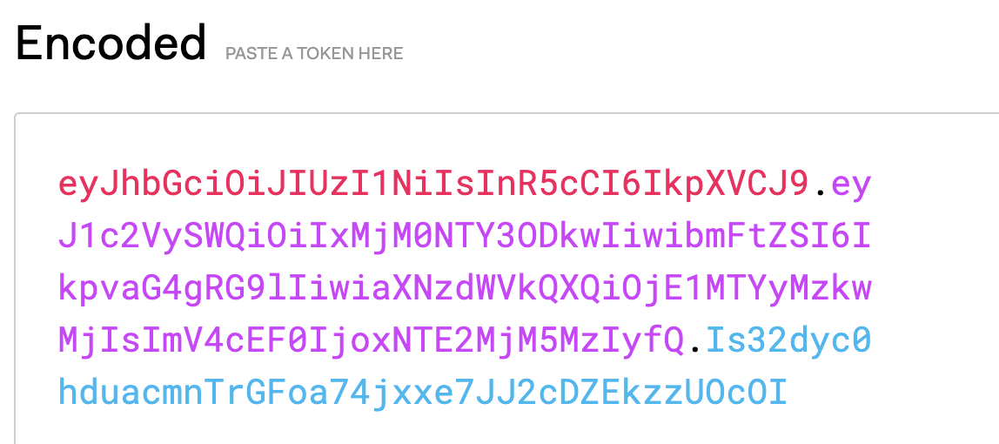
  - **JWT token verification process**: When the public-private key pair is generated at the server level during token generation, the public key is required to verify the signature & payload.

    This is a tool available [here](https://jwt.io/).

    When on server side, the token is generated we edit the RHS & generate the token on LHS.

    When we receive the token from the client, we paste the token on LHS & verify the token, payload (claims) on RHS.

    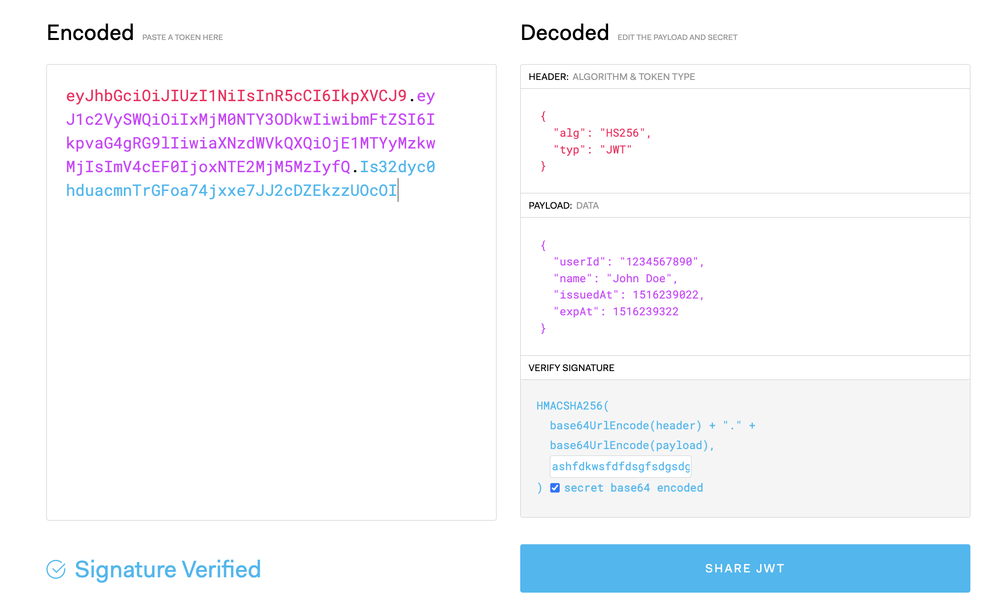

    Here, a common secret key is used. But, ideally we should be using public key to verify the signature. And the corresponding private key should be used to generate the signature during token generation process (happened before).

  - Use cases:

    - For microservices based approach, the payload is going to vary. So, there are going to be different JWTs for different resources. So, the JWT is going to be different for different microservices. Suppose, a user wants to access a shopping cart for a particular product. So, the JWT for the shopping cart is going to be different from the JWT for the payment gateway. It would look like this:

    ```json
    {
      "items": [0, 2, 4],
      "iat": 1493139659,
      "exp": 1493143259
    }
    ```

  - Coding:

    - How to generate token on server side: In this example, we're creating a JWT token that includes a userId and email in the payload. We're also specifying a secretKey that will be used to sign the token, and an expiresIn option that sets the token to expire in one hour. The jwt.sign function returns the signed token, which can then be sent back to the client. <kbd>chatGPT</kbd>

    ```js
    const jwt = require("jsonwebtoken");

    const payload = { userId: 1234, email: "user@example.com" };
    const secretKey = "mysecretkey";

    const token = jwt.sign(payload, secretKey, { expiresIn: "1h" });
    console.log(token);
    ```

    - Now let's take a look at how the client can use the JWT token to authenticate subsequent requests. Here's an example of how to include the token in the Authorization header of an HTTP request using the axios library:

    ```js
    const axios = require("axios");

    const token = "eyJhbGciOiJIUzI1NiIsInR5cCI6IkpXVCJ9...";

    axios
      .get("https://api.example.com/users", {
        headers: { Authorization: `Bearer ${token}` },
      })
      .then((response) => {
        console.log(response.data);
      })
      .catch((error) => {
        console.log(error);
      });
    ```

    In this example, we're making an HTTP GET request to the https://api.example.com/users endpoint, and including the JWT token in the `Authorization` header as a `Bearer` token. The server can then verify the token by checking the signature and decoding the payload, and use the information in the payload to authenticate or authorize the user. <kbd>chatGPT</kbd>

  - **Security risks**:

    - **Local storage** is a common place to store JWT tokens because it's easily accessible and can store large amounts of data. However, local storage is vulnerable to cross-site scripting (XSS) attacks, where an attacker injects malicious code into a website to steal the token. To mitigate this risk, developers should ensure that their websites are protected against XSS attacks by properly sanitizing input and output, using content security policies, and using HTTP-only cookies.

    - **HTTP-only cookies** are another option for storing JWT tokens. These cookies are not accessible by JavaScript, which makes them more secure against XSS attacks. However, they can be vulnerable to cross-site request forgery (CSRF) attacks, where an attacker tricks a user into making a request to a website without their knowledge. To prevent CSRF attacks, developers should include CSRF tokens in their forms and APIs, and use techniques like the "same-site" attribute and anti-CSRF libraries.

  More on JWT [here](../../docs/jwt-handbook-v0_14_1.pdf).

- [ ] Email templating (Required for sending OTP, tokens, reset-password) using Twilio API (SMTP protocol).
  - Use case: If developer needs to send OTP to a user, there should be a email templating done. So, the email has to be templated.
- [ ] Kafka
- [ ] gRPC
- [ ] RabbitMQ

## References

- [System Design YT playlist | Gaurav Sen](https://www.youtube.com/watch?v=xpDnVSmNFX0&list=PLMCXHnjXnTnvo6alSjVkgxV-VH6EPyvoX)
- [Low level design | Gaurav Sen](https://www.youtube.com/watch?v=gktZsX9Z8Kw&list=PLMCXHnjXnTnvQVh7WsgZ8SurU1O2v_UM7)
- [Low level design | sudoCODE](https://www.youtube.com/watch?v=B3zrIwz_t4M&list=PLTCrU9sGybupCpY20eked6blbHI4zZ55k)
- [Vertical Scalability vs Horizontal Scalability | Visual Explanations](https://www.youtube.com/watch?v=YE1ytf15WOQ) ✅
- [System Design Basics: Horizontal vs. Vertical Scaling | Gaurav Sen](https://youtu.be/xpDnVSmNFX0) ✅
- [Difference between cookies, session and tokens](https://www.youtube.com/watch?v=GhrvZ5nUWNg) ✅
- [Cookies, Sessions, JSON Web Tokens (JWT) and More](https://www.youtube.com/watch?v=uXDnS5PcjCA)
